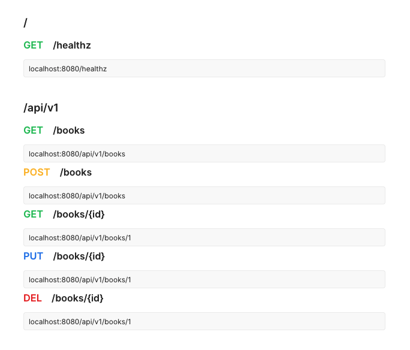

# Learning Cloud Native Go - myapp
Cloud Native Application Development is a one way of speeding up building web applications, using micro-services, containers and orchestration tools.

As the first step, this repository shows **How to build a Dockerized RESTful API application using Go**. 

>💡Refer commit messages and `step-` branches for a step by step guild. (Blog: _Coming soon!_)

## Points to Highlight
- Usage of Docker and Docker Compose.
- Usage of Golang and MySQL Alpine images.
- Usage of Docker Multistage builds.
- [Liveness and Readiness APIs for K8s](https://kubernetes.io/docs/tasks/configure-pod-container/configure-liveness-readiness-probes/).
- Usage of [Goose](https://github.com/pressly/goose) for Migrations.
- Usage of [GORM](https://gorm.io/) as the ORM.
- Usage of [Chi](https://github.com/go-chi/chi) as the Router.
- Usage of [Zerolog](https://github.com/rs/zerolog) as the Logger.
- Usage of [Validator.v9](https://gopkg.in/go-playground/validator.v9) as the Form Validator.

💭 Hope to use [Wire](https://github.com/google/wire) for Compile-time Dependency Injection in the future.

### Endpoints


### Docker Image Sizes
```bash
REPOSITORY                 TAG                 SIZE
myapp_app                  latest              58.7MB
myapp_db                   latest              233MB
```


## Design Decisions & Project Folder Structure
- Store Docker related files inside the `docker` folder. But keep the `docker-compose.yml` file in the project root.
- Store executable packages inside the `cmd` folder.
- Store database migrations inside the `migrations` folder.
- Store main application code inside the `app` folder.
- Store reusable packages like configs, utils, models and repositories in separate folders. This will be helpful if you are adding more executable applications to support web front-ends, [publish/subscribe systems](https://en.wikipedia.org/wiki/Publish%E2%80%93subscribe_pattern), [document stores](https://en.wikipedia.org/wiki/Document-oriented_database) and etc.

```bash
.
├── docker
│  ├── app
│  │  ├── bin
│  │  │  ├── init.sh
│  │  │  └── wait-for-mysql.sh
│  │  └── Dockerfile
│  └── mariadb
│     └── Dockerfile
├── docker-compose.yml
│
├── cmd
│  ├── app
│  │  └── main.go
│  └── migrate
│     └── main.go
│
├── migrations
│  └── 20190805170000_create_books_table.sql
│
├── app
│  ├── app
│  │  ├── app.go
│  │  ├── book_handler.go
│  │  ├── health_handler.go
│  │  └── index_handler.go
│  ├── requestlog
│  │  ├── handler.go
│  │  └── log_entry.go
│  └── router
│     ├── middleware
│     │  ├── content_type_json.go
│     │  └── content_type_json_test.go
│     └── router.go
│
├── config
│  └── config.go
│
├── adapter
│  ├── db
│  │  └── db.go
│  └── gorm
│     └── gorm.go
│
├── util
│  ├── logger
│  │  ├── logger.go
│  │  └── logger_test.go
│  └── validator
│     └── validator.go
|     └── validator_test.go
│
├── model
│  └── book.go
├── repository
│  └── book.go
│
├── go.mod
└── go.sum
```

>💡About `app/app/app.go`; Some prefer `app/server/server.go` or `http/app/app.go`

### Form Validation


### Logs

