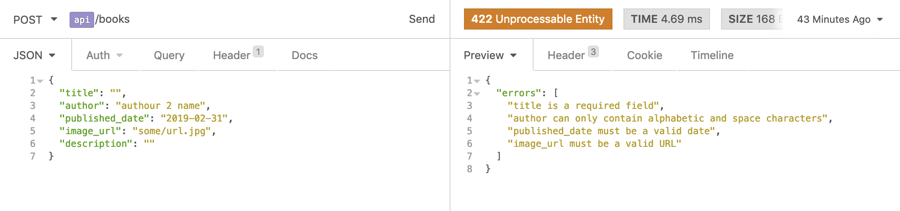
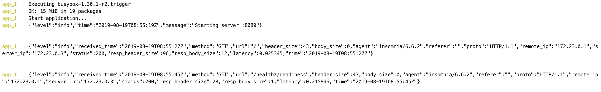
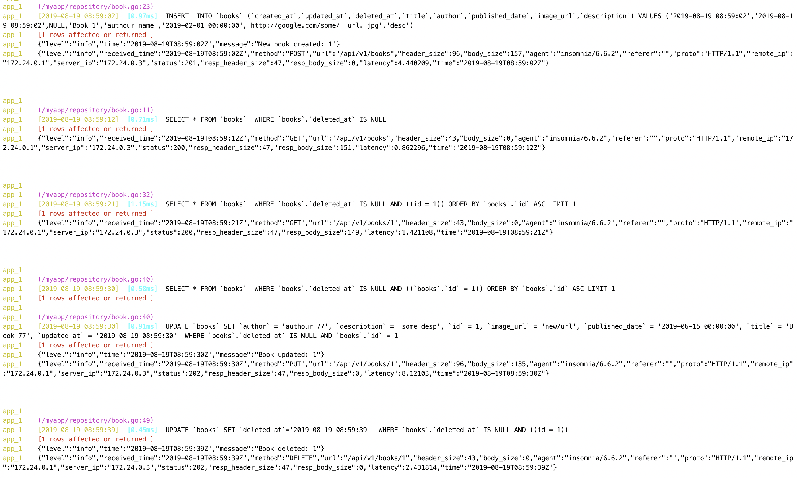

# Learning Cloud Native Go - myapp
> 🌱 Cloud Native Application Development is one way of speeding up the building of web applications using microservices, containers, and orchestration tools.

This repository shows how to build a Dockerized RESTful API application in Go for a simple bookshelf.

## 🔋 Batteries included

- The idiomatic structure based on the resource-oriented design.
- The usage of Docker, Docker compose, Alpine images, and linters on development.
- Healthcheck and CRUD API implementations with OpenAPI specifications.
- The usage of [Goose](https://github.com/pressly/goose) for the database migrations and [GORM](https://gorm.io/) as the database ORM.
- The usage of [Zerolog](https://github.com/rs/zerolog) as the centralized Syslog logger.
- The usage of [Validator.v10](https://github.com/go-playground/validator) as the form validator.
- The usage of GitHub actions to run tests and linters, generate OpenAPI specifications, and build and push production images to the Docker registry.

## 🚀 Endpoints

| Name        | HTTP Method | Route          |
|-------------|-------------|----------------|
| Health      | GET         | /livez         |
|             |             |                |
| List Books  | GET         | /v1/books      |
| Create Book | POST        | /v1/books      |
| Read Book   | GET         | /v1/books/{id} |
| Update Book | PUT         | /v1/books/{id} |
| Delete Book | DELETE      | /v1/books/{id} |

💡 [swaggo/swag](https://github.com/swaggo/swag) : `swag init -g cmd/api/main.go -o .swagger -ot yaml`

## 🗄️ Database design

| Column Name    | Datatype  | Not Null | Primary Key |
|----------------|-----------|----------|-------------|
| id             | UUID      | ✅        | ✅           |
| title          | TEXT      | ✅        |             |
| author         | TEXT      | ✅        |             |
| published_date | DATE      | ✅        |             |
| image_url      | TEXT      |          |             |
| description    | TEXT      |          |             |
| created_at     | TIMESTAMP | ✅        |             |
| updated_at     | TIMESTAMP | ✅        |             |
| deleted_at     | TIMESTAMP |          |             |

## 📦 Container image sizes

- DB: 241MB
- API
    - Development environment: 655MB
    - Production environment: 28MB ; 💡`docker build -f prod.Dockerfile . -t myapp_app`

## 📁 Project structure

```shell
myapp
├── cmd
│  ├── api
│  │  └── main.go
│  └── migrate
│     └── main.go
│
├── api
│  ├── router
│  │  └── router.go
│  │
│  └── resource
│     ├── health
│     │  └── handler.go
│     ├── book
│     │  ├── api.go
│     │  ├── handler.go
│     │  ├── model.go
│     │  └── repository.go
│     └── common
│        └── err
│           └── err.go
│
├── migrations
│  └── 00001_create_books_table.sql
│
├── config
│  └── config.go
│
├── util
│  ├── logger
│  │  └── logger.go
│  └── validator
│     └── validator.go
│
├── .env
│
├── go.mod
├── go.sum
│
├── docker-compose.yml
├── Dockerfile
│
├── prod.Dockerfile
└── k8s
   ├── app-configmap.yaml
   ├── app-secret.yaml
   ├── app-deployment.yaml
   └── app-service.yaml
```

## 📸 Form validations and logs




